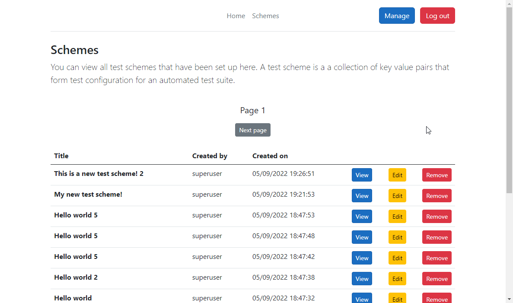

<div id="top"></div>

<div align="center">
 <a href="https://github.com/kylejuliandev/dev_blog_assignment">
    
  </a>
  <h3 align="center">Test Data Manager Coursework Submission</h3>
  <p align="center">
    By Kyle Juian
  </p>
</div>

<details>
  <summary>Table of Contents</summary>
  <ol>
    <li><a href="#introduction">About The Project</a></li>
    <li>
      <a href="#getting-started">Getting Started</a>
      <ul>
        <li><a href="#prerequisites">Prerequisites</a></li>
        <li><a href="#installation">Installation</a></li>
        <li><a href="#data">Data</a></li>
      </ul>
    </li>
    <li><a href="#example-request">Example request</a></li>
  </ol>
</details>

<br />

## Introduction

A simple ASP.NET Core 6.0 Blazor Server Web Application that allows users to create and manage test data configuration. This project serves as Kyle Julian's 2022 Summer Assignment for Software Development and DevOps module. This project serves to aid Quality Assurance and Automation Testers with managing, creating, and accessing test schemes and test scheme data items. A test scheme is a bundle of test items that relate to a specific test case.

## Getting started

### Prerequisities

This project is built using the below technologies. You will need to install them locally before developing the site.

* [ASP.NET Core 6.0 SDK](https://dotnet.microsoft.com/en-us/download/dotnet/6.0)
* [Visual Studio Community Edition](https://visualstudio.microsoft.com/downloads/)
* [Entity Framework Core](https://docs.microsoft.com/en-us/ef/core/cli/dotnet#installing-the-tools)

Entity Framework Core is the ORM "Object relational mapper" that manages data access to the SQLite database. The Entity Framework Core CLI is needed to apply and revert migrations to the database.

### Installation

1. Clone the repository

    ```ps1
    git clone https://github.com/kylejuliandev/test-data-manager-assignment.git
    ```

1. Open the folder where the repository has been cloned

    1. Navigate to the Manager.Web folder

        ```ps1
        cd manager-web\src\Manager.Web
        ```

1. Run the Entity Framework tools to apply the migrations

    ```ps1
    dotnet ef database update
    ```

### Data

Below illustrates the initial database design and concept to fulfil the requirements of this project. The proposal includes two tables, namely: Schemes and SchemeData. Schemes is home to the grouping of a set of scheme data. Scheme data relates to a single test configuration (key/value pair).


Tables prefix with `AspNet` are scaffolded by Visual Studio and provide the authentication and authorization capabilities.

`CreatedById` is a foreign key that contains the `AspNetUsers.Id`

`ModifiedById` is a foreign key that contains the `AspNetUsers.Id`

`SchemeId` is a foreign key that contains the `Schemes.Id`

A Scheme will have many Scheme Data. A Scheme will have one CreatedBy AspNetUser. A Scheme will have one ModifiedBy AspNetUser.

A SchemeData will have one CreatedBy AspNetUser. A SchemeData will have one ModifiedBy AspNetUser.

This permits a AspNetUser having many Schemes and many SchemeData (one to many).

#### Changing the design

When changing the design (see [Data files](manager-web/src//Manager.Web/Data/)) you will need to generate a new migration file, that will contain the SQL definition of the changes being made.

```ps1
dotnet ef migrations add MyNewMigrations
```

```ps1
dotnet ef database update
```

To revert the migration, you can use the following. This will remove the latest migration made. You will need to rerun the database update command for this to be reflected in you database.

```ps1
dotnet ef migrations remove
```

If you need to teardown the database you can use the following command

```ps1
dotnet ef database drop
```

This is not reversible, and you will be asked to confirm before the deletion occurs.

## Example request

Below depicates a sequence diagram of the steps involved for navigating to and loading content from the dev blog. The diagram neglects to illustrate the role of Internet Service Providers, Domain Name Servers, and Internet registrars, however it simply visualises a typical workflow through the web application.


